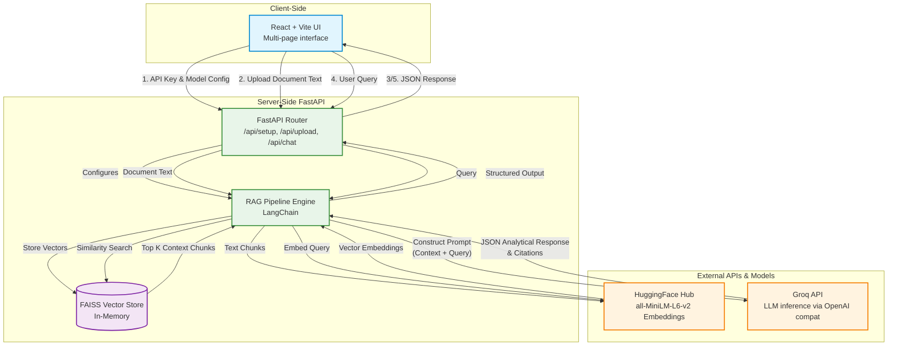

# Financial Report Analyzer - Architecture Diagram

```mermaid
graph TD
    %% Frontend Node
    subgraph Frontend [Client-Side]
        ReactUI[React + Vite UI\nMulti-page interface]
    end

    %% Backend Node
    subgraph Backend [Server-Side FastAPI]
        API[FastAPI Router\n/api/setup, /api/upload, /api/chat]
        RAG[RAG Pipeline Engine\nLangChain]
        FAISS[(FAISS Vector Store\nIn-Memory)]
    end

    %% External Services Node
    subgraph ExternalServices [External APIs & Models]
        HF[HuggingFace Hub\nall-MiniLM-L6-v2 Embeddings]
        GROQ[Groq API\nLLM inference via OpenAI compat]
    end

    %% Data Flow
    ReactUI -- "1. API Key & Model Config" --> API
    ReactUI -- "2. Upload Document Text" --> API
    ReactUI -- "4. User Query" --> API

    API -- "Configures" --> RAG
    
    %% Document Upload Flow
    API -- "Document Text" --> RAG
    RAG -- "Text Chunks" --> HF
    HF -- "Vector Embeddings" --> RAG
    RAG -- "Store Vectors" --> FAISS
    
    %% Query Flow
    API -- "Query" --> RAG
    RAG -- "Embed Query" --> HF
    RAG -- "Similarity Search" --> FAISS
    FAISS -- "Top K Context Chunks" --> RAG
    RAG -- "Construct Prompt\n(Context + Query)" --> GROQ
    GROQ -- "JSON Analytical Response\n& Citations" --> RAG
    RAG -- "Structured Output" --> API
    API -- "3/5. JSON Response" --> ReactUI
    
    %% Styling
    classDef default fill:#f9f9f9,stroke:#333,stroke-width:1px;
    classDef frontend fill:#e1f5fe,stroke:#0288d1,stroke-width:2px;
    classDef backend fill:#e8f5e9,stroke:#388e3c,stroke-width:2px;
    classDef external fill:#fff3e0,stroke:#f57c00,stroke-width:2px;
    classDef database fill:#f3e5f5,stroke:#7b1fa2,stroke-width:2px;

    class ReactUI frontend;
    class API,RAG backend;
    class HF,GROQ external;
    class FAISS database;
```
